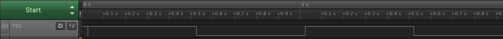

# Blink an LED

This project shows how to blink an LED connected to a GPIO pin. The LED spends 500 ms in an ON state and 500 ms in an OFF state.

## Related Documentation

More details and code examples for the AVR128DA48:

- [TB3229 - Getting Started with General Purpose Input/Output (GPIO)](https://ww1.microchip.com/downloads/en/Appnotes/Getting-Started-with-GPIO-DS90003229B.pdf)
- [AVR128DA48 Product Page](https://www.microchip.com/wwwproducts/en/AVR128DA48)
- [AVR128DA48 Code Examples on GitHub](https://github.com/microchip-pic-avr-examples?q=avr128da48)
- [AVR128DA48 Project Examples in START](https://start.atmel.com/#examples/AVR128DA48CuriosityNano)

## Software Used

- [MPLAB® X IDE](http://www.microchip.com/mplab/mplab-x-ide) v6.10 or newer
- [MPLAB XC8](http://www.microchip.com/mplab/compilers) v2.41 or newer
- [AVR®-Dx Series Device Pack](https://packs.download.microchip.com/) v2.3.272 or newer
- [MPLAB Code Configurator](https://www.microchip.com/en-us/tools-resources/configure/mplab-code-configurator) v5.3.7 or newer
- [MPLAB Code Configurator Melody](https://www.microchip.com/en-us/tools-resources/configure/mplab-code-configurator/melody) v2.5.0 or newer
- AVR Devices Library v4.7.0 or newer
- Content Manager v4.2.6 or newer

## Hardware Used

- AVR128DA48 Curiosity Nano ([DM164151](https://www.microchip.com/Developmenttools/ProductDetails/DM164151))

## Setup

The AVR128DA48 Curiosity Nano Development board is used as a test platform.

 

The following configurations must be made for this project:

- System clock: 3.33 MHz

|    Pin    | Configuration  |
| :-------: | :------------: |
| PC6 (LED) | Digital output |

## Operation

1.  Connect the board to the PC.

2.  Open the `Blink_an_LED.X` project in MPLAB X.

3.  Set the `Blink_an_LED.X` project as main project. Right click the project in the **Projects** tab and click Set as Main Project.

 

4.  Clean and build the project. Right click the `Blink_an_LED.X` project and select Clean and Build.

 

5.  Select the AVR128DA48 Curiosity Nano in the Connected Hardware Tool section of the project settings:

- Right click the project and click Properties
- Click the arrow under the Connected Hardware Tool
- Select the AVR128DA48 Curiosity Nano (click SN), click **Apply** and then click **OK**:

 

6.  Program the project to the board. Right click the project and click Make and Program Device.

 

Demo:

 

This image shows the waveform of the pin connected to the LED. The pin spends 500 ms in a high state and 500 ms in a low state.

## Summary

This project shows how to blink an LED connected to a GPIO pin of the microcontroller.
