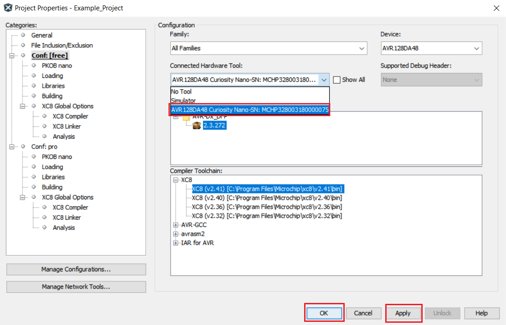

# Blink an LED

This project shows how to blink an LED connected to a GPIO pin. The LED spends 500 ms in an ON state and 500 ms in an OFF state.

## Related Documentation

More details and code examples on the AVR128DA48 can be found at the following links:

- [TB3229 - Getting Started with General Purpose Input/Output (GPIO)](https://ww1.microchip.com/downloads/en/Appnotes/Getting-Started-with-GPIO-DS90003229B.pdf)
- [AVR128DA48 Product Page](https://www.microchip.com/wwwproducts/en/AVR128DA48)
- [AVR128DA48 Code Examples on GitHub](https://github.com/microchip-pic-avr-examples?q=avr128da48)
- [AVR128DA48 Project Examples in START](https://start.atmel.com/#examples/AVR128DA48CuriosityNano)

## Software Used

- MPLAB® X IDE 5.40 or newer [(microchip.com/mplab/mplab-x-ide)](http://www.microchip.com/mplab/mplab-x-ide)
- MPLAB® XC8 2.30 or a newer compiler [(microchip.com/mplab/compilers)](http://www.microchip.com/mplab/compilers)
- MPLAB® Code Configurator (MCC) 4.0.1 or newer [(microchip.com/mplab/mplab-code-configurator)](https://www.microchip.com/mplab/mplab-code-configurator)
- MPLAB® Code Configurator (MCC) Device Libraries 8-bit AVR® MCUs 2.5.0 or newer [(microchip.com/mplab/mplab-code-configurator)](https://www.microchip.com/mplab/mplab-code-configurator)
- AVR-Dx 1.4.75 or newer Device Pack

## Hardware Used

- AVR128DA48 Curiosity Nano [(DM164151)](https://www.microchip.com/Developmenttools/ProductDetails/DM164151)

## Setup

The AVR128DA48 Curiosity Nano Development Board is used as test platform.

 

The following configurations must be made for this project:

System clock: 3.33 MHz

|    Pin    | Configuration  |
| :-------: | :------------: |
| PC6 (LED) | Digital output |

## Operation

1.  Connect the board to the PC.

2.  Open the Blink_an_LED.X project in MPLAB® X.

3.  Set the Blink_an_LED.X project as main project. Right click on the project in the **Projects** tab and click **Set as Main Project**.

 

4.  Clean and build the Blink_an_LED.X project. Right click on the **Blink_an_LED.X** project and select **Clean and Build**.

 

5.  Select the **AVR128DA48 Curiosity Nano** in the Connected Hardware Tool section of the project settings:

- Right click on the project and click **Properties**;
- Click on the arrow under the Connected Hardware Tool;
- Select the **AVR128DA48 Curiosity Nano** (click on the **SN**), click **Apply** and then click **OK**:

 

6.  Program the project to the board. Right click on the project and click **Make and Program Device**.

 

Demo:

 

This image shows the waveform of the pin connected to the LED. The pin spends 500 ms in a high state and 500 ms in a low state.

## Summary

This project shows how to blink an LED connected to a GPIO pin of the microcontroller.
