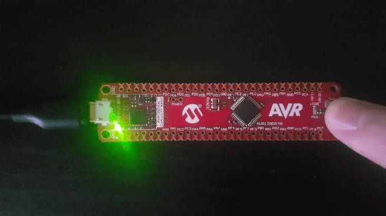

<!-- Please do not change this logo with link -->

# Long and Short Button Press

This code example uses a GPIO pin configured as input to distinguish between a long and short button press, defined by a delay threshold. An LED’s blink rate is slow if a long press is detected, and fast if a short press is detected.

## Related Documentation

More details and code examples on the AVR128DA48 can be found at the following links:

- [TB3229 Getting Started with GPIO (General Purpose Input/Output)](http://ww1.microchip.com/downloads/en/Appnotes/90003229A.pdf)
- [AVR128DA48 Product Page](https://www.microchip.com/wwwproducts/en/AVR128DA28)
- [AVR128DA48 Code Examples on GitHub](https://github.com/microchip-pic-avr-examples?q=avr128da48)
- [AVR128DA48 Project Examples in START](https://start.atmel.com/#examples/AVR128DA48CuriosityNano)

## Software Used

- MPLAB® X IDE 5.40 or newer [(microchip.com/mplab/mplab-x-ide)](http://www.microchip.com/mplab/mplab-x-ide)
- MPLAB® XC8 2.30 or a newer compiler [(microchip.com/mplab/compilers)](http://www.microchip.com/mplab/compilers)
- MPLAB® Code Configurator (MCC) 4.0.2 or newer [(microchip.com/mplab/mplab-code-configurator)](https://www.microchip.com/mplab/mplab-code-configurator)
- MPLAB® Code Configurator (MCC) Device Libraries 8-bit AVR® MCUs 2.5.0 or newer [(microchip.com/mplab/mplab-code-configurator)](https://www.microchip.com/mplab/mplab-code-configurator)
- AVR-Dx 1.6.88 or newer Device Pack

## Hardware Used

- AVR128DA48 Curiosity Nano [(DM164151)](https://www.microchip.com/Developmenttools/ProductDetails/DM164151)

## Setup

The AVR128DA48 Curiosity Nano Development Board is used as test platform.

 

The following configurations must be made for this project:

<Configurations>

- System clock is 3.33 MHz

| Pin |         Configuration          |
| :-: | :----------------------------: |
| PC7 | Digital input, pull-up enabled |
| PC6 |   Digital output, start high   |

## Operation

1.  Connect the board to the PC.

2.  Open the Detect_Long_And_Short_Button_Press.X project in MPLAB® X IDE.

3.  Set the Detect_Long_And_Short_Button_Press.X project as main project. Right click on the project in the **Projects** tab and click **Set as Main Project**.

 

4.  Clean and build the Detect_Long_And_Short_Button_Press.X project. Right click on the **Detect_Long_And_Short_Button_Press.X** project and select **Clean and Build**.

 

5.  Select the **AVR128DA48 Curiosity Nano** in the Connected Hardware Tool section of the project settings:

- Right click on the project and click **Properties**;
- Click on the arrow under the Connected Hardware Tool;
- Select the **AVR128DA48 Curiosity Nano** (click on the **SN**), click **Apply** and then click **OK**:

 

6.  Program the project to the board. Right click on the project and click **Make and Program Device**.

 

## Demo

 

In the first image, the button short press is followed by the LED blinking at a fast rate.

 

In the second image, the button long press is followed by the LED blinking at a slow rate.

 

In the last image, the complete demo is shown.

## Summary

The GPIO interface can be used to sense external digital signals in order to make certain decisions. In this code example, the focus was on the push of a button. An LED’s blink rate was slow if a long press was detected, and fast if a short press was detected.
