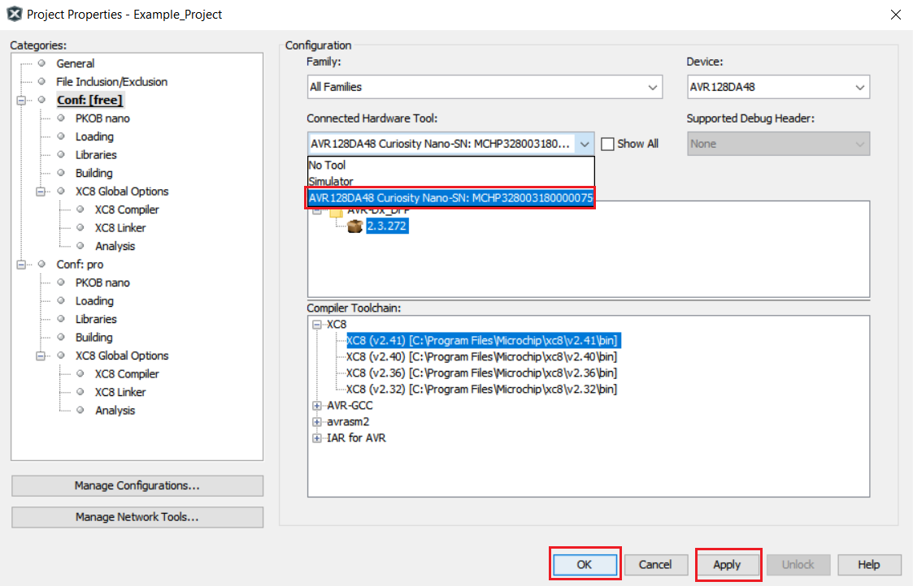

# Wake-up on Button Press

This project demonstrates the usage of interrupts and Sleep mode. The microcontroller exits Sleep on button press, turns on an LED and goes back to Sleep. On button release, it exits Sleep, turns off the LED and goes back to Sleep. The LED is ON while the button is pressed, but the device can be in Sleep mode.

## Related Documentation

More details and code examples for the AVR128DA48:

- [TB3229 - Getting Started with General Purpose Input/Output (GPIO)](https://ww1.microchip.com/downloads/en/Appnotes/Getting-Started-with-GPIO-DS90003229B.pdf)
- [AVR128DA48 Product Page](https://www.microchip.com/wwwproducts/en/AVR128DA48)
- [AVR128DA48 Code Examples on GitHub](https://github.com/microchip-pic-avr-examples?q=avr128da48)
- [AVR128DA48 Project Examples in START](https://start.atmel.com/#examples/AVR128DA48CuriosityNano)

## Software Used

- [MPLAB® X IDE](http://www.microchip.com/mplab/mplab-x-ide) v6.10 or newer
- [MPLAB XC8](http://www.microchip.com/mplab/compilers) v2.41 or newer
- [AVR®-Dx Series Device Pack](https://packs.download.microchip.com/) v2.3.272 or newer
- [MPLAB Code Configurator](https://www.microchip.com/en-us/tools-resources/configure/mplab-code-configurator) v5.3.7 or newer
- [MPLAB Code Configurator Melody](https://www.microchip.com/en-us/tools-resources/configure/mplab-code-configurator/melody) v2.5.0 or newer
- AVR Devices Library v4.7.0 or newer
- Content Manager v4.2.6 or newer

## Hardware Used

- AVR128DA48 Curiosity Nano ([DM164151](https://www.microchip.com/Developmenttools/ProductDetails/DM164151))

## Setup

The Curiosity Nano Development board is used as a test platform.

 

The following configurations must be made for this project:

- System clock: 3.3 MHz
- Sleep mode: Power-Down
- Global Interrupts enabled

|     Pin      |         Configuration          |
| :----------: | :----------------------------: |
|  PC6 (LED)   |   Digital output, start high   |
| PC7 (Button) | Digital input, pull-up enabled |

## Operation

1.  Connect the board to the PC.

2.  Open the Wake_Up_On_Button_Press.X project in MPLAB X.

3.  Set the Wake_Up_On_Button_Press.X project as main project. Right click the project in the **Projects** tab and click **Set as Main Project**.

 

4.  Clean and build the project. Right click the Wake_Up_On_Button_Press.X project and select **Clean and Build**.

 

5.  Select the AVR128DA48 Curiosity Nano in the Connected Hardware Tool section of the project settings:

- Right click the project and click Properties
- Click the arrow under the Connected Hardware Tool
- Select the AVR128DA48 Curiosity Nano (click SN), click **Apply** and then click **OK**:

 

6.  Program the project to the board. Right click the project and click **Make and Program Device**.

 

Demo:
 

The image above shows the waveform of the button and the LED pins.

## Summary

This demo shows how to use the device in Sleep mode. The device exits Sleep mode on button press, turns on an LED and goes back to Sleep. On button release, the device exits Sleep, turns off the LED and goes back to Sleep.
